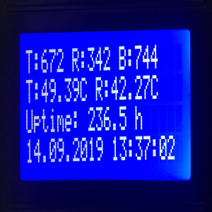

# ioBroker.i2clcd

**Tests:**: 

## i2clcd adapter for ioBroker

I2C-LCD 16x2 or 20x4 Display based on HD44780-compatible Displays with PCF8574

tested on Raspberry Pi 3B+ and Raspbery Pi 4
should also run on Tinkerboard

### using this adapter

Enable I2C on your device (raspi-config etc.) and
wire the display to the I2C-bus.
Install the adapter, set up bus no, I2C-address (as decimal value!) and choose your type of display in the configuration.

Datapoints:

"DisplayLightOn" turns on/of the backlight
"DisplayBlink" lets blink the backlight in the desired setInterval
"DisplayBlinkTime" sets up the Interval for "DisplayBlink"
"DisplayLine1"..."DisplayLine4" writes the user-defined text to the desired line

Adapter based on node.js-library lcdi2c (https://www.npmjs.com/package/lcdi2c)

Works with Nodejs 10 only! WIP...

## Changelog

### 0.0.8
* (raspilc) rework to make compatible with nodejs 12/14

### 0.0.5
* (raspilc) fixed some errors

### 0.0.3
* (raspilc) fixed error in bus choice

### 0.0.2
* (raspilc) added choice of bus no in admin

### 0.0.1
* (raspilc) initial release

## License
MIT License

Copyright (c) 2019 raspilc <info@raspilc.de>

Permission is hereby granted, free of charge, to any person obtaining a copy
of this software and associated documentation files (the "Software"), to deal
in the Software without restriction, including without limitation the rights
to use, copy, modify, merge, publish, distribute, sublicense, and/or sell
copies of the Software, and to permit persons to whom the Software is
furnished to do so, subject to the following conditions:

The above copyright notice and this permission notice shall be included in all
copies or substantial portions of the Software.

THE SOFTWARE IS PROVIDED "AS IS", WITHOUT WARRANTY OF ANY KIND, EXPRESS OR
IMPLIED, INCLUDING BUT NOT LIMITED TO THE WARRANTIES OF MERCHANTABILITY,
FITNESS FOR A PARTICULAR PURPOSE AND NONINFRINGEMENT. IN NO EVENT SHALL THE
AUTHORS OR COPYRIGHT HOLDERS BE LIABLE FOR ANY CLAIM, DAMAGES OR OTHER
LIABILITY, WHETHER IN AN ACTION OF CONTRACT, TORT OR OTHERWISE, ARISING FROM,
OUT OF OR IN CONNECTION WITH THE SOFTWARE OR THE USE OR OTHER DEALINGS IN THE
SOFTWARE.
